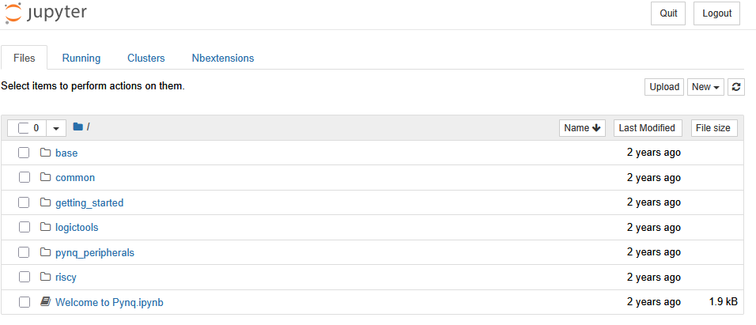
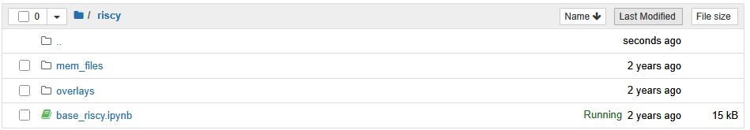

# PDP-Project

## Getting started

Required software if running in the server:

* Jupyer Notebooks
* X2GO: see [resources](#resources).
* VSCode (recommended)

Required software if running locally:

* Jupyer Notebooks
* [Vivado 2024.2](https://www.xilinx.com/support/download.html): Free version is enough for the FPGA we target.
* [LLVM](https://llvm.org/docs/GettingStarted.html#getting-the-source-code-and-building-llvm): see [install llvm](#install-llvm)
* [RISCV GCC](https://github.com/riscv-collab/riscv-gnu-toolchain): see [install gcc](#install-gcc)
* VSCode (recommended)

Guides:

* [Workflow](workflow)
* [Hardware: vivado and rtl](#hardware-vivado-project-and-rtl)
* [Hardware: running the design on the FPGA](#hardware-running-on-the-fpga)
* [Working with the server](#run-server)
* [Guides for local tool setup](#run-locally)
* [Resources](#resources)


Terms:
* **Memory initialization files (.coe)**: these are just the initial contents of a memory written in a format that vivado understands.

* **Out of Context (OOC) synthesis**: running synthesis of an IP or module independently from the rest of the system, it is an intermediate step to check that there isn't anything fundamentally wrong with your design or to get an initial estimation of resources/timing without having to synthesize the whole design.

## Workflow

The expected workflow for the project is as follows:

* Initially you are given a working software AES C code and a working riscy core. Go through every step first to understand what happens:
  1. Check what the C code does.
  2. Compile the C code into memory initialization files.
  3. Check what the FPGA system and the testbench look like.
  4. Simulate using your memory initialization files.
  5. Run OOC synthesis to check baseline results.
  6. Generate bitstream and run in the FPGA.

* If you write new C code or modify LLVM: proceed to generate the `.coe` files of your C program and verify it works in simulation.

* If you modify your core: write program to test or modify testbench as needed and verify in simulation.

* If it works in simulation, verify it passes timing and check the utilization reports for anything unexpected via OOC synthesis.

* If everything seems fine in OOC synthesis, proceed to generate bitstream and benchmark in FPGA.

* Repeat

## Hardware: Vivado project and RTL

### Sources:

The source code of the riscy core can be found under: `pdp-project/hardware/src/design/riscy`.

The simulation testbench can be found at: `pdp-project/hardware/src/simulation/zynq_tb.sv`.

The system being simulated and implemented on the fpga is generated out of a tcl script (`pdp-project/hardware/scripts/generate_fpga_bd.tcl`), the format is not very user friendly, so it is recommended to open the bd directly in vivado when trying to understand it.

### Scripts:

A few scripts to perform all the basic steps are provided under `pdp-project/hardware/scripts`, they all require to be under `pdp-project/hardware/` when executing them.

Open vivado, and from the tcl console within it:

```
cd ./pdp-project/hardware

# To create the base project:
source ./scripts/create_project.tcl

# To run simulation and select some waveforms (run after create_project.tcl)
source ./run_simulation.tcl

# To generate the bitstream from the open project (run after create_project.tcl):
source ./run_synth_impl.tcl

# To create the base project and generate the bitstream (run from a clean open vivado):
source ./scripts/gen_bitstream.tcl

# To run Out of Context (OOC) synthesis of the riscy core and output timing and utilization results (run from a clean open vivado):
source ./create_project_ooc_synth.tcl
```

### Generated files:

The generated bitstream and other products of the full project can be found under the generated folder: `pdp-project/hardware/vivado/riscy/riscy.runs/impl_1`.

The OOC synthesis results can be found under the generated folder: `pdp-project/hardware/vivado/ooc_riscy/ooc_riscy.runs/ooc_synth`.

The hardware hand off file can be found under the generated directory:
`pdp-project/hardware/vivado/riscy/riscy.gen/sources_1/bd/riscv/hw_handoff/riscv.hwh`.
This file is used as part of the Overlay to write the bitstream to the fpga via Jupyter Notebooks.

## Hardware: Running on the FPGA

It is possible to connect the PYNQ board via ethernet cable to your pc, that way you can run Jupyter Notebooks in the hardened ARM core (processing_system) of the FPGA.

Using this conexion method we can read and write the instructions and data memories connected to the riscy core, start and stop the execution (fetch) of the core or perform reads and writes to any other IP connected to the processing_system.

### Setup:

* The SD card in the PYNQ board already has all the software required for this, you will only need to set up your PC to be able to access it via ethernet.

* Make sure the board is correctly setup, this is explained [here](https://pynq.readthedocs.io/en/latest/getting_started/pynq_z1_setup.html).

* You will have to set up the IP address of your laptop, instructions [here](https://pynq.readthedocs.io/en/latest/appendix/assign_a_static_ip.html#assign-a-static-ip-address).

* Then you can connect via web browser by typing the following broswer address: `http://192.168.2.99/`; or ssh into it with: `ssh xilinx@192.168.2.99`. We recommend you to use the browser.
If you are asked for a username or a password, it is `xilinx` for both.

### Use:

Once logged in, you will be able to browse its contents and run Jupyter Notebooks, this is how the home screen looks, where there should be a copy of the base riscy fpga directory:



If the initial copy of the riscy fpga directory is not present, or you just want a fresh one, you can find it under: `pdp-project/hardware/src/sw/fpga`. This base directory contains a bitstream, memory initialization files and a jupyter notebook generated to run the base software AES implementation in the riscy core on the FPGA.

The base riscy fpga directory contains:



-`base_riscy.ipynb`: base notebook to control the riscv core execution, showing how to write the bitstream to the fpga, perform reads/writes, control the core, and check the results of the AES software binaries running on the core.

-`mem_files`: should contain: `data.coe` and `code.coe`, those are the memory initialization files generated from the software AES C code and used by the notebook to load the program.

-`overlays`: should contain: `base_riscy.bit`, `base_riscy.hwh` and `base_riscy.tcl`. These are the files required to write the bitstream to the rpgrammable logic (PL) and setup the processing system to perform reads/writes. If you generate a new bitstream, you will have to copy and rename to `base_riscy` both `riscv_wrapper.bit` and `riscv_wrapper.tcl` from the implementation directory, and the hardware hand off (`.hwh`) file from the gen directory (`pdp-project/hardware/vivado/riscy/riscy.gen/sources_1/bd/riscv/hw_handoff/riscv.hwh`).

### Base notebook

Open `base_riscy.ipynb`, you can execute the cells one by one in order and observe the behaviour. The notebook cells do the following:

1. Select the bitstream file, set up a few variables used to write/read from the PL, and define a couple of helper functions (initialize memories).
2. Program the bitstream to the FPGA.
3. Reboot the RISCY core.
4. Load instruction and data memories using the helper functions and the memory initialization files.
5. Start the execution of the program by asserting fetch enable.
6. Check the outputs generated by the execution of the core.

## Software

### C code and binaries generation

The source C code of the software AES implementation can be found under: `pdp-project/software/main.c`.

First you will need to update the paths (RISCV_GCC and LLVM) found in the configuration file `pdp-project/software/config/rv32-standard.conf` to point to your specific install of the riscv gcc and llvm.

To generate the binaries and the memory initialization files used for vivado simulation and fpga runs just:

```
cd pdp-project/software

make soft
```

You can find the generated binaries under `pdp-project/software/output` and the memory initialization files under `pdp-project/software/bin_files`.

You are encouraged to inspect and understand the Makefile compilation commands.

### LLVM modifications

The provided LLVM toolchain in the server is already compiled, but after any modification to the backend of llvm it is necessary to recompile the llvm toolchain.

If you have only modified the RISCV backend, you don't need to recompile the whole LLVM, to save time by recompiling only the modified RISCV backed do:

```
cd /path/to/wherever/your/llvm/build/is #TBD
cmake -G Ninja  -DLLVM_TARGETS_TO_BUILD="RISCV" -DLLVM_ENABLE_PROJECTS="clang;lld" -DCMAKE_BUILD_TYPE=Release -DLLVM_BUILD_TESTS=OFF -DLLVM_INCLUDE_TESTS=OFF "../llvm/"

ninja
```

## Run server

A server has been setup with all the contents needed for the course.
Every group will get a unique user and password shared between all the members to access it. 

It is highly recommended to logout when you stop working, as it will keep on consuming resources otherwise (you will be logued out automatically as well after 4 hours, so save your work).

### Connect

**You need to use VPN if you access the server from eduroam or outside of the TU Delft.**

[X2GO setup instructions](https://qce-it-infra.ewi.tudelft.nl/faq.html#how-to-setup-x2go-for-the-qce-xportal-server).

Hostname: ce-procdesign01.ewi.tudelft.nl

We will send you the login username and password once the groups are registered.

### Edit files

Two ways are available to edit files directly in the server:

* Within the server: vim or gedit.

* From your pc, use VSCode with the [VSCode ssh plugin](https://carleton.ca/scs/2024/vscode-remote-access-and-code-editing/).

### Directory structure

All the tools are already installed in it and available under the directory: `~/course`. This directory should not be used to store changes or other files that were not there in the first place.

The tools and projects available in the shared directory:
* RISCV GCC
* Standard LLVM
* PDP-Project: both hardware and software

We recommend copying the PDP-Project and the LLVM to your local area, as you will need to edit/generate files:

```
cp ~/course/pdp-project ~/pdp-project
cp ~/course/llvm ~/llvm
```

Once copied, make sure to update the configuration file `pdp-project/software/config/rv32-standard.conf` to point to your specific install of llvm (update path assigned to variables `RISCV_GCC` and `LLVM`).


## Run locally

If you want to run stuff locally you can clone this repo and install the tools used by it as explained below, we recommend the use of the server, but a local setup might be nice for some users.

### Install llvm

Source: [instructions](https://llvm.org/docs/GettingStarted.html#getting-the-source-code-and-building-llvm).
```
git clone https://github.com/llvm/llvm-project.git

cd llvm-project

mkdir build-release

cd build-release

cmake -G Ninja  -DLLVM_TARGETS_TO_BUILD="RISCV" -DLLVM_ENABLE_PROJECTS="clang;lld" -DCMAKE_BUILD_TYPE=Release -DLLVM_BUILD_TESTS=OFF -DLLVM_INCLUDE_TESTS=OFF "../llvm/"

ninja -j6
```

### Install GCC

Source: [instructions](https://github.com/riscv-collab/riscv-gnu-toolchain).
```
git clone https://github.com/riscv/riscv-gnu-toolchain

cd riscv-gnu-toolchain

#On ubuntu (for other check link):
sudo apt-get install autoconf automake autotools-dev curl python3 python3-pip python3-tomli libmpc-dev libmpfr-dev libgmp-dev gawk build-essential bison flex texinfo gperf libtool patchutils bc zlib1g-dev libexpat-dev ninja-build git cmake libglib2.0-dev libslirp-dev

./configure --prefix=./riscv --with-arch=rv32imafdcbk --with-abi=ilp32d

make
```

## Resources

* [RISC-V Cryptography Extension](https://lists.riscv.org/g/dev-partners/attachment/43/0/riscv-crypto-spec-scalar-v0.9.3-DRAFT.pdf).
* [Adding custom instruction to LLVM backend](https://github.com/10x-Engineers/clang-builtin-tutorial).
* [PYNQ board setup](https://pynq.readthedocs.io/en/latest/getting_started/pynq_z1_setup.html).
* [X2GO setup for QCE servers use](https://qce-it-infra.ewi.tudelft.nl/faq.html#how-to-setup-x2go-for-the-qce-xportal-server).